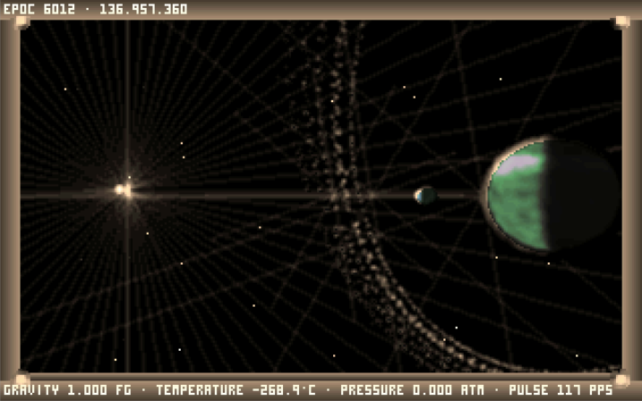

# Noctis IV LR

[](https://forthebadge.com)
[](https://forthebadge.com)


 



**PLEASE NOTE: This project is a heavy WIP. It is unstable and unfinished. Additionally, I recommend not reading any part of this codebase. It will probably cause permanent harm to both your eyeballs and eliminate your faith in humanity**

Noctis IV LR aims to eventually port Noctis IV to run on Linux and Modern Windows. The starting point was the base Noctis IV source code. Neither NIV+ nor NICE were used because the added layer of cruft on top of both would have made the work of porting it more difficult. The bugs fixed by NIV+, however, will all also be fixed in Noctis IV LR before a stable release.

The goal for Noctis IV LR is to maintain compabitility with the original Noctis IV. That means that stars should generate in the same positions, and planets should look the same. Testing has not been exhaustive, but the star and planet generation is currently thought to be compatible.

Noctis IV LR runs on both Linux and Windows.

## Demo
There is a semi-functional [web demo](http://users.wpi.edu/~dcole/noctis/). This demo is not necessarily up to date, and should not be taken as representative of the stability of this port. A web version is not an end goal, and it is only around to quickly demonstrate things.

## Compiling
The only strict dependency of Noctis IV LR is SDL2.
### Linux
The package installation instructions are only provided for Ubuntu. It is assumed that if you are using another distro you are experienced enough to figure things out yourself.
First, install SDL2.
```
sudo apt-get install libsdl2-dev
```
Then make sure all of the programs needed to build Noctis IV LR are installed.
```
sudo apt-get install clang cmake
```
Finally, build the program.
```
cmake . -DCMAKE_C_COMPILER="/usr/bin/clang" -DCMAKE_CXX_COMPILER="/usr/bin/clang++"
make
```
### Windows
**Please Note:** The game is extremely buggy on Windows right now, to a [significantly](https://i.imgur.com/9km1Osf.gif) greater extent than on Linux. Fixing bugs that only exist under Windows is not a current priority.

Build instructions are not currently provided for Windows, but it can be built by following similar steps to the Linux instructions above in MSYS2 using the mingw-w64 packages. 

## Port Status
- [x] Space Game Logic
- [x] Star & Planet Generation
- [x] Space Object Rendering
- [x] Flat-Shaded 3D Rendering
- [x] High Resolution Texture Mapping
- [ ] Low Resolution Texture Mapping
- [x] Planetary Game Logic
- [ ] Planetary Object Rendering
- [ ] Planet Surface Generation
- [x] Saving & Loading
- [ ] GOESnet Modules

The checklist serves to give a good overview, but there are too many minor quirks to mention here. For example, I don't actually have the faintest idea what framerate the game is supposed to run at and there are a lot of timing issues.

## Differences from Vanilla
* SUPPORTS.NCT is loaded from the res/ folder instead of being appended to the binary.
* Fixed a bug with triads dexter above 1000. 

## License
Released under the terms of the [WTOF Public License](LICENSE.md) under Alex's conditions that the original gameplay be preserved.
